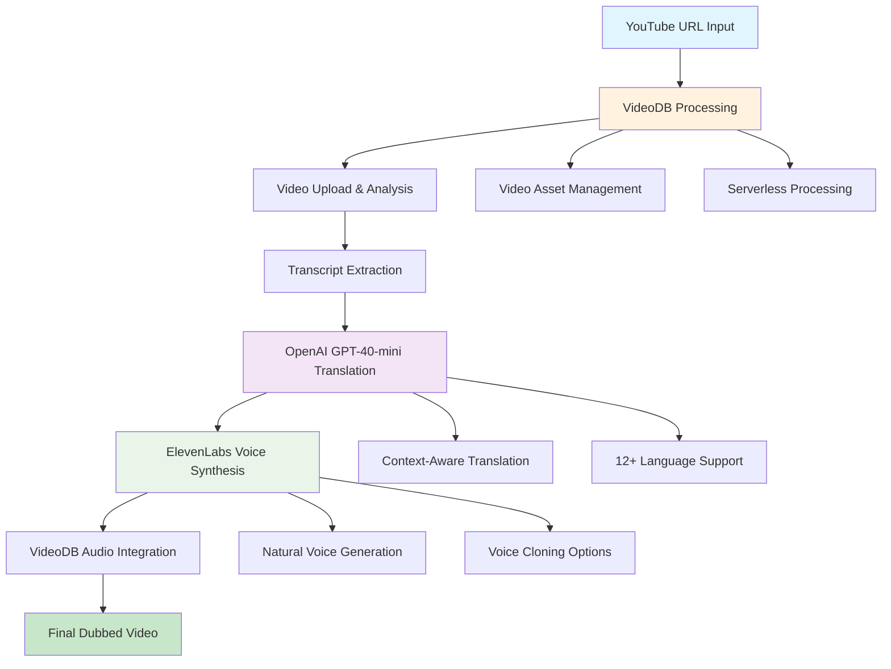

# 🎬 AI Video Dubbing Platform

[](https://github.com/yourusername/videodb)
[](https://python.org)
[](https://fastapi.tiangolo.com)
[](LICENSE)

> **Built for the AI Demos X VideoDB Hackathon** - A revolutionary AI-powered platform that transforms any YouTube video into 12+ languages in minutes.

## 🌟 Project Overview

This AI dubbing platform democratizes video localization by combining three cutting-edge AI services: **VideoDB** for video processing, **OpenAI GPT-4o-mini** for intelligent translation, and **ElevenLabs** for natural voice synthesis. What traditionally takes weeks and costs thousands of dollars can now be accomplished in minutes.

### 🎯 Problem Statement
- 75% of internet users don't speak English as their primary language
- Traditional dubbing is expensive and time consuming
- Content creators lose massive global audience due to language barriers
- Professional dubbing is inaccessible to individual creators and small businesses

### 💡 Our Solution
An AI-powered platform that:
- Processes any YouTube video in real-time
- Generates professional-quality dubs in 12+ languages
- Reduces cost 
- Reduces time 

## ✨ Key Features

### 🎥 **Intelligent Video Processing**
- **Direct YouTube Integration**: Paste any YouTube URL and start dubbing
- **Automatic Transcript Extraction**: Powered by VideoDB's advanced speech recognition
- **Real-time Progress Tracking**: Live updates throughout the entire process
- **Professional Quality Output**: Studio-grade video and audio synchronization

### 🌍 **Multi-Language Excellence**
- **12+ Language Support**: English, Spanish, French, German, Italian, Portuguese, Russian, Japanese, Korean, Chinese, Hindi, Arabic
- **Context-Aware Translation**: GPT-4 powered translation that preserves meaning and tone
- **Cultural Adaptation**: Maintains cultural nuances and idiomatic expressions
- **Automatic Language Detection**: Intelligently detects source language

### 🎙️ **Advanced Voice Synthesis**
- **Natural AI Voices**: Human-like intonation and pronunciation using ElevenLabs
- **Voice Cloning Capability**: Option to maintain original speaker's voice characteristics
- **Multi-language Voice Models**: Native-sounding pronunciation for each supported language
- **Emotional Expression**: Preserves emotional tone and emphasis from original content

### ⚡ **Performance & Scalability**
- **Serverless Architecture**: Leverages VideoDB's cloud infrastructure
- **Async Processing**: Non-blocking operations for optimal performance
- **Real-time Updates**: WebSocket-based progress tracking
- **Error Recovery**: Robust fallback mechanisms and retry logic

## 🏗️ System Architecture



## 🛠️ Technology Stack

### **Backend Architecture**
- **FastAPI**: Modern, high-performance web framework with automatic API documentation
- **Python 3.8+**: Core programming language with async/await support
- **Uvicorn**: Lightning-fast ASGI server for production deployment
- **Pydantic**: Data validation and settings management

### **AI Services Integration**
- **VideoDB**: Serverless video infrastructure for processing and storage
- **OpenAI GPT-4o-mini**: Advanced language model for context-aware translation
- **ElevenLabs**: State-of-the-art voice synthesis and cloning technology

### **Frontend & UI**
- **HTML5/CSS3/JavaScript**: Modern web technologies
- **Bootstrap 5**: Responsive UI framework
- **Real-time Progress Tracking**: AJAX-based status updates

### **Development Tools**
- **Environment Management**: python-dotenv for configuration
- **API Documentation**: Automatic OpenAPI/Swagger documentation
- **Logging**: Comprehensive application logging and monitoring


## 🚀 Quick Start Guide

### **Prerequisites**
- **Python 3.8+** installed on your system
- **API Keys** for the following services:
  - [VideoDB API Key](https://console.videodb.io) - Free tier available
  - [OpenAI API Key](https://platform.openai.com) - Pay-per-use pricing
  - [ElevenLabs API Key](https://elevenlabs.io) - Free tier with 10k characters/month

### **Installation Steps**

#### 1. Clone the Repository
```bash
git clone https://github.com/yourusername/ai-dubbing-platform.git
cd ai-dubbing-platform
```

#### 2. Set Up Virtual Environment (Recommended)
```bash
# Create virtual environment
python -m venv venv

# Activate virtual environment
# On Windows:
venv\Scripts\activate
# On macOS/Linux:
source venv/bin/activate
```

#### 3. Install Dependencies
```bash
pip install -r requirements.txt
```

#### 4. Configure Environment Variables
```bash
# Copy the example environment file
cp .env.example .env

# Edit .env file with your API keys
nano .env  # or use your preferred editor
```

**Required Environment Variables:**
```env
# VideoDB Configuration
VIDEODB_API_KEY=your_videodb_api_key_here

# OpenAI Configuration
OPENAI_API_KEY=your_openai_api_key_here

# ElevenLabs Configuration
ELEVENLABS_API_KEY=your_elevenlabs_api_key_here

# Application Configuration (Optional)
APP_HOST=0.0.0.0
APP_PORT=8000
DEBUG=True
```

#### 5. Launch the Application
```bash
python main.py
```

#### 6. Access the Web Interface
Open your browser and navigate to: **http://localhost:8000**

### **First-Time Setup Verification**
1. Visit `/api/health` to check service status
2. Verify all API keys are properly configured
3. Test with a short YouTube video (30-60 seconds recommended)

## 📋 Detailed API Setup Guide

### **VideoDB Setup**
1. **Create Account**: Visit [VideoDB Console](https://console.videodb.io)
2. **Get API Key**: Navigate to your dashboard and copy the API key
3. **Free Tier**: Includes generous limits for development and testing
4. **Documentation**: [VideoDB API Docs](https://docs.videodb.io)

### **OpenAI Setup**
1. **Create Account**: Visit [OpenAI Platform](https://platform.openai.com)
2. **Generate API Key**: Go to API Keys section and create a new key
3. **Billing**: Set up billing (pay-per-use model)
4. **Model Access**: Ensure access to GPT-4o-mini model
5. **Rate Limits**: Check your organization's rate limits

### **ElevenLabs Setup**
1. **Create Account**: Visit [ElevenLabs](https://elevenlabs.io)
2. **Get API Key**: Find your API key in Profile Settings
3. **Free Tier**: 10,000 characters per month included
4. **Voice Library**: Access to 29+ premium voices
5. **Voice Cloning**: Available on paid plans

## 🎯 Usage Guide

### **Web Interface Workflow**

#### **Step 1: Video Input**
- Paste any YouTube URL in the input field
- The system validates the URL and shows video preview
- Supports videos of any length (shorter videos process faster)

#### **Step 2: Language Selection**
- Choose from 12+ supported languages
- System automatically detects source language
- Preview translation before generating audio (optional)

#### **Step 3: Voice Configuration**
- Select from available AI voices
- Option to clone original speaker's voice
- Preview voice samples for each language

#### **Step 4: Processing**
- Real-time progress tracking with detailed steps
- Processing typically takes 30-120 seconds
- Background processing allows multiple concurrent jobs

#### **Step 5: Results**
- Download dubbed video in high quality
- Compare original vs dubbed versions
- Share or embed the final result


## 🌍 Supported Languages & Voices

| Language | Code | Native Name | Voice Quality | Sample Voices |
|----------|------|-------------|---------------|---------------|
| **English** | `en` | English | Premium | Rachel, Drew, Clyde |
| **Spanish** | `es` | Español | Premium | Bella, Antonio, Valentina |
| **French** | `fr` | Français | Premium | Charlotte, Henri, Gabrielle |
| **German** | `de` | Deutsch | Premium | Giselle, Hans, Marlene |
| **Italian** | `it` | Italiano | Premium | Bianca, Giorgio, Francesca |
| **Portuguese** | `pt` | Português | Premium | Camila, Ricardo, Fernanda |
| **Russian** | `ru` | Русский | Premium | Natasha, Vladimir, Katarina |
| **Japanese** | `ja` | 日本語 | Premium | Akiko, Takeshi, Yuki |
| **Korean** | `ko` | 한국어 | Premium | Seoyeon, Minho, Jisoo |
| **Chinese** | `zh` | 中文 | Premium | Xiaoxiao, Yunyang, Xiaochen |
| **Hindi** | `hi` | हिन्दी | Premium | Aditi, Ravi, Kavya |
| **Arabic** | `ar` | العربية | Premium | Zahra, Omar, Layla |

### **Voice Features**
- **Natural Intonation**: Human-like speech patterns and emphasis
- **Emotional Expression**: Maintains tone and emotion from original content
- **Cultural Adaptation**: Proper pronunciation and cultural context
- **Voice Cloning**: Advanced option to maintain original speaker characteristics

## 🔧 Development 

### **Project Structure**
```
ai-dubbing-platform/
├── main.py                 # FastAPI application entry point
├── config.py              # Configuration management
├── requirements.txt       # Python dependencies
├── .env.example          # Environment variables template
├── services/             # Business logic modules
│   ├── __init__.py
│   ├── dubbing_service.py    # Main orchestration service
│   ├── videodb_service.py    # VideoDB API integration
│   ├── translation_service.py # OpenAI translation logic
│   └── voice_service.py      # ElevenLabs voice synthesis
├── templates/            # HTML templates
│   └── index.html           # Main web interface
├── static/              # Static assets
│   ├── css/
│   │   └── style.css        # Custom styling
│   └── js/
│       └── app.js           # Frontend JavaScript
└── docs/                # Documentation
    ├── API_DOCUMENTATION.md
    └── DEPLOYMENT.md

```
### **Local Development**
```bash
# Install development dependencies
pip install -r requirements.txt

# Run with auto-reload for development
uvicorn main:app --reload --host 0.0.0.0 --port 8000
```
#### **Environment Variables for Production**
```env
# Production settings
DEBUG=False
APP_HOST=0.0.0.0
APP_PORT=8000

# API Keys (use secure secret management)
VIDEODB_API_KEY=${VIDEODB_API_KEY}
OPENAI_API_KEY=${OPENAI_API_KEY}
ELEVENLABS_API_KEY=${ELEVENLABS_API_KEY}

# Optional: Custom model settings
OPENAI_MODEL=gpt-4o-mini
SUPPORTED_LANGUAGES=en,es,fr,de,it,pt,ru,ja,ko,zh,hi,ar
```


## 📄 License

This project is licensed under the **MIT License** - see the [LICENSE](LICENSE) file for details.

### **Third-Party Services**
- **VideoDB**: Subject to VideoDB Terms of Service
- **OpenAI**: Subject to OpenAI Usage Policies
- **ElevenLabs**: Subject to ElevenLabs Terms of Use

## 🆘 Support & Community

### **Getting Help**
- **GitHub Issues**: [Report bugs or request features](https://github.com/yourusername/ai-dubbing-platform/issues)
- **Discussions**: [Join community discussions](https://github.com/yourusername/ai-dubbing-platform/discussions)
- **Documentation**: Check our comprehensive [API Documentation](API_DOCUMENTATION.md)

### **Hackathon Context**
This project was built for the **AI Demos X VideoDB Hackathon**, showcasing the power of combining multiple AI services to solve real-world problems. The hackathon provided an excellent opportunity to:
- Explore cutting-edge AI APIs
- Build practical applications with immediate value
- Learn from the AI development community
- Push the boundaries of what's possible with AI

### **Community**
- **Star the repository** if you find it useful
- **Share your dubbed videos** and tag us
- **Contribute improvements** and new features
- **Spread the word** about AI-powered content creation

---
## 🎉 Acknowledgments

Special thanks to:
- **AI Demos** for organizing an incredible hackathon
- **VideoDB** for providing powerful video infrastructure
- **OpenAI** for advanced language models
- **ElevenLabs** for revolutionary voice synthesis
- **The open-source community** for inspiration and tools

---

**Built with ❤️ for the AI Demos X VideoDB Hackathon**

*Breaking language barriers, one video at a time.* 🌍
